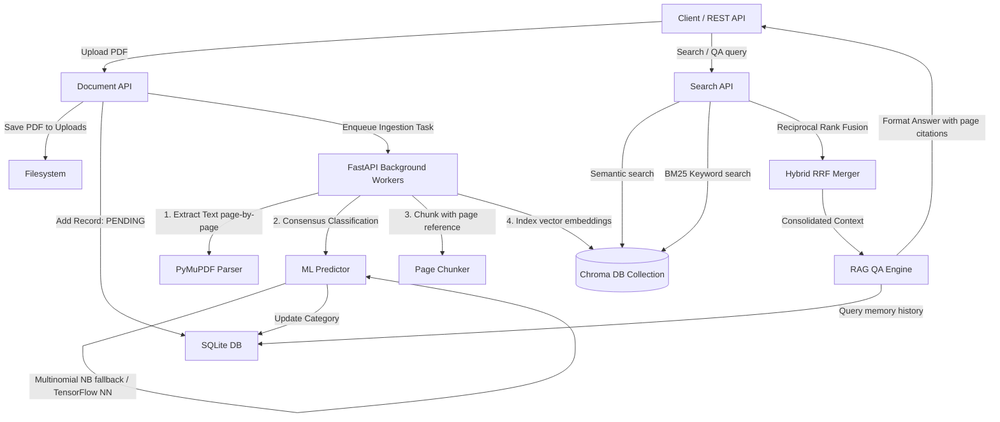

# AI Research & Knowledge Assistant

A production-oriented Retrieval-Augmented Generation (RAG) backend application that enables users to upload technical research PDFs, automatically classify them using a Machine Learning predictor, query them using hybrid keyword/semantic search, run session-based Q&A with proper source citations, and generate comparative summaries.

---

## 1. Architecture Diagram



---

## 2. Technology Stack

*   **Framework**: FastAPI (high-performance asynchronous Python REST framework)
*   **Vector Store**: Chroma DB (embedding database for semantic storage and retrieval)
*   **Database**: SQLite (SQL engine managed via SQLAlchemy ORM for metadata, metrics, and chat history)
*   **Document Parsing**: PyMuPDF (extremely fast layout-preserving PDF parser)
*   **Embedding Model**: `all-MiniLM-L6-v2` via HuggingFace Hub (downloaded locally by Chroma)
*   **LLM Provider**: LangChain / OpenAI API (Gemini or local options supported)
*   **Machine Learning**: TensorFlow 2.x (Neural Network classification) + Scikit-Learn (Multinomial Naive Bayes pipeline fallback)

---

## 3. Setup Instructions

### Prerequisites
*   Python 3.10 to 3.13
*   Git

### Installation
1.  **Clone the Repository**:
    ```bash
    git clone https://github.com/ananyadarna/AI-Research-Knowledge-Assistant.git
    cd "AI-Research-Knowledge-Assistant"
    ```

2.  **Create and Activate Virtual Environment**:
    ```bash
    python -m venv .venv
    # Windows
    .venv\Scripts\activate
    # macOS/Linux
    source .venv/bin/activate
    ```

3.  **Install Pinned Dependencies**:
    ```bash
    pip install -r requirements.txt
    ```

4.  **Configure Environment Variables**:
    Create a `.env` file from the template:
    ```bash
    copy .env.example .env
    ```
    Open `.env` and fill in your API key (e.g. `OPENAI_API_KEY=your_key`).

5.  **Pre-train Classification Assets (Optional but Recommended)**:
    Train the document classifier locally on synthetic dataset:
    ```bash
    python -m src.ml.train_classifier
    ```

6.  **Run FastAPI Application**:
    ```bash
    python main.py
    # Server will start on http://127.0.0.1:8000
    ```

7.  **Run Unit & Integration Test Suite**:
    ```bash
    python -m pytest -v
    ```

---

## 4. Environment Variables

Define the following in your `.env` file:

| Variable | Description | Default / Example |
| :--- | :--- | :--- |
| `OPENAI_API_KEY` | OpenAI API credential for RAG, summary, and comparisons | `sk-...` |
| `EMBEDDING_PROVIDER`| Provider for text vectorization (`openai`, `gemini`, or `local`) | `local` |
| `DATABASE_URL` | SQLAlchemy connection string | `sqlite:///./data/assistant.db` |
| `VECTOR_DB_DIR` | Chroma DB persistence storage directory | `./data/vector_db` |
| `UPLOAD_DIR` | Location to save uploaded source PDF files | `./data/uploads` |
| `MODEL_PATH` | Path where trained TF classification models reside | `./models/tf_classifier.h5` |
| `SKLEARN_MODEL_PATH`| Path to the scikit-learn Naive Bayes fallback model | `./models/sklearn_classifier.pickle` |

---

## 5. API Documentation

For full Swagger interactive docs, navigate to `http://127.0.0.1:8000/docs` while the server is running.

### 5.1 Document Management
*   **Upload Document**: `POST /documents/upload`
    *   *Payload*: Multipart form file (`file: UploadFile`)
    *   *Response*: `{"doc_id": "...", "processing_status": "PENDING"}`
*   **List Documents**: `GET /documents`
    *   *Response*: Returns a JSON list of document metadata.
*   **Reprocess Document**: `POST /documents/{doc_id}/reprocess`
    *   *Response*: Wipes vector store elements and resets processing state to `PENDING`.
*   **Delete Document**: `DELETE /documents/{doc_id}`
    *   *Response*: Wipes SQL record, vector DB chunks, and filesystem upload.

### 5.2 Search & RAG Q&A
*   **Search Retrieval**: `POST /search/query`
    *   *Payload*: `{"query": "neural networks", "search_mode": "hybrid", "doc_ids": ["uuid"], "top_k": 3}`
    *   *Response*: List of ranked chunks with relevance scores.
*   **RAG QA Conversation**: `POST /search/qa`
    *   *Payload*: `{"session_id": "optional-session", "query": "What is the training accuracy?", "doc_ids": ["uuid"]}`
    *   *Response*: Answer text + `citations` list (containing source text, filename, and page numbers).

### 5.3 Summary & Comparison
*   **Document Summarization**: `POST /analysis/summarize/{doc_id}`
    *   *Response*: JSON block containing `executive_summary`, `technical_summary`, `bullet_points`, and `key_takeaways`.
*   **Multi-Document Comparison**: `POST /analysis/compare`
    *   *Payload*: `{"doc_ids": ["uuid1", "uuid2"]}`
    *   *Response*: Comparative grid outlining methodologies, advantages, disadvantages, differences, and conclusions.

### 5.4 Analytics Dashboard
*   **System Telemetry Stats**: `GET /analytics/stats`
    *   *Response*: JSON containing metrics (`total_documents`, `total_chunks`, `total_embeddings_generated`, `total_questions_answered`, `category_distribution`, `most_queried_documents`).

---

## 6. Assumptions & Design Decisions

### 6.1 Page-by-Page Chunking Strategy
Instead of splitting text purely by character counts which overlaps pages randomly, we partition text **page-by-page**. This design decision guarantees that:
1.  **Citations are 100% accurate**: Each chunk corresponds to precisely one physical PDF page number.
2.  **No context boundary bleed**: Avoids mixing text context from neighboring unrelated pages.

### 6.2 Reciprocal Rank Fusion (RRF) Hybrid Search
Combining keyword matches (BM25) and semantic vector distance requires joining different scoring bounds. We implemented RRF:
$$\text{Score}(d) = \sum_{m \in M} \frac{1}{60 + \text{Rank}_m(d)}$$
This ranks chunks that have high scores in *both* modes higher, providing maximum search precision.

### 6.3 Dual-Model Machine Learning Fallback
*   **TensorFlow Neural Net**: Multi-layer Dense Net with OOV Embedding layers.
*   **Scikit-Learn NB Fallback**: Uses `TfidfVectorizer` + `MultinomialNB`. If a Python 3.13 workspace or environment has network limits blocking TensorFlow downloads, the system automatically falls back to loading scikit-learn models.

---

## 7. Limitations & Future Improvements

1.  **Symlink Support on Windows**: Windows systems without Developer Mode enabled may show warning logs when Chroma caches HuggingFace tokenizers. Standard file copies fallback automatically.
2.  **OCR Support**: Currently assumes text is readable. Scanned document indexing would require Tesseract/OCR libraries.
3.  **Reranking Models**: Adding Cohere or Cross-Encoder model rerankers after RRF would further improve citation scoring in multi-document comparisons.
